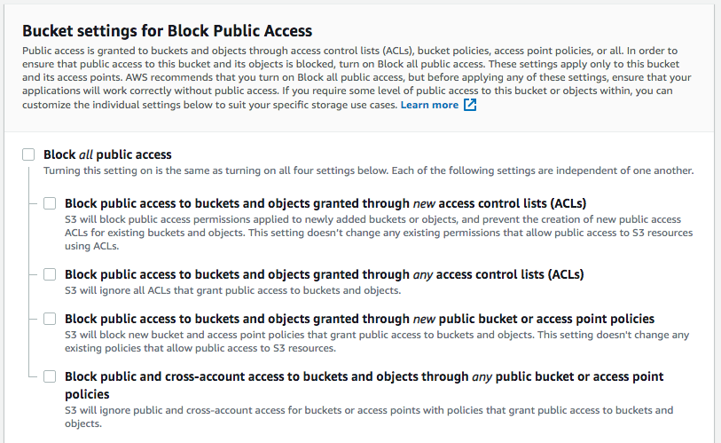

# Lab session 5: Deploy a custom web app using additional cloud services

This hands-on session is based on
the [AWS Elastic Beanstalk tutorial](https://docs.aws.amazon.com/gettingstarted/latest/deploy/overview.html). Here, we
are going to build a small web application using [Django](https://www.djangoproject.com/) which is a modern framework
that uses Python to create web applications.

## AWS IaaS: Elastic Beanstalk

Elastic Beanstalk is a high-level deployment tool that helps you get an app from your desktop to the web in a matter of
minutes. Elastic Beanstalk handles the details of your hosting environment—capacity provisioning, load balancing,
scaling, and application health monitoring—so you don't have to.

Elastic Beanstalk supports apps developed in Python as well as many other programming languages. It also admits multiple
configurations for each platform. A platform configuration defines the infrastructure and software stack to be used for
a given environment.

Elastic Beanstalk provisions a set of AWS resources for the application that you deploy: Amazon EC2 instances, alarms, a
load balancer, security groups, and more.

The software stack that runs your application depends on the platform configuration type. For example, Elastic Beanstalk
supports several configurations for Python 3.x.

You can interact with Elastic Beanstalk by using the **AWS Management Console**, the **AWS Command Line Interface (AWS
CLI)**, or the **Elastic Beanstalk CLI**: a high-level CLI designed explicitly for Elastic Beanstalk.

For this tutorial, we'll use the `Elastic Beanstalk CLI` since you used the `AWS Management Console` in a previous
session.

## Deploying an example Web App Using Elastic Beanstalk

We are going to assume that you are working on a new subject on Cloud Computing that isn't ready for students to enroll
yet, but in the meantime, you plan to deploy a small placeholder app that collects contact information from the website
visitors who sign up to hear more. The signup app will help you reach potential students who might take part in a
private beta test of the laboratory sessions.

### The Signup App

The app will allow your future students to submit contact information and express interest in a preview of the new
subject on Cloud Computing that you're developing.

To make the app look good, we use [Bootstrap](https://getbootstrap.com/), a mobile-first front-end framework that
started as a Twitter project.

### AWS DynamoDB

We are going to use **Amazon DynamoDB**, a NoSQL database service, to store the contact information that users submit.
DynamoDB is a schema-less database, so you need to specify only a primary key attribute. Let us use the email field as a
key for each register.

### AWS Simple Notification Service (SNS)

We want to know when customers submit a form, therefore we are going to use **AWS Simple Notification Service** (AWS
SNS), a message pushing service that can deliver notifications over various protocols. For our web app, we are going to
push notifications to an email address.

### AWS CloudFront CDN

A content delivery network or content distribution network (CDN) is a geographically distributed network of proxy
servers that disseminate a service spatially, as close to end-users as possible, to provide high availability, low
latency, and high performance.

The information that flows every day on the Internet can be classified as "static" and "dynamic" content. The "dynamic"
part is the one that changes depending on the user's input. It is distributed by, for instance, PaaS servers with load
balancers. The "static" part does not change based on the user's input and it can be moved as close to the end user as
possible to improve the "user experience".

Nowadays, CDNs serve a substantial portion of the "static" content of the Internet: text, graphics, scripts,
downloadable media files (documents, software products, videos, etc.), live streaming media, on-demand streaming media,
social networks and so much more.

Content owners pay CDN operators to deliver the content that they produce to their end users. In turn, a CDN pays ISPs (
Internet Service Providers), carriers, and network operators for hosting its servers in their data centers.

**AWS CloudFront CDN** is a global CDN service that securely delivers static content with low latency and high transfer
speeds. CloudFront CDN works seamlessly with other AWS services including **AWS Shield** for DDoS mitigation, **AWS S3
**, **Elastic Load Balancing** or **AWS EC2** as origins for your applications, and **AWS Lambda** to run custom code
close to final viewers.

# Tasks for Lab session #5

## Prerequisites

You need to have `AWS CLI` and `AWS EB CLI` installed and configured. Please
complete [Getting Started in the Cloud (with AWS)](https://github.com/CCBDA-UPC/Cloud-Computing-QuickStart/blob/master/Quick-Start-AWS.md)
before beginning work on this assignment.

* [Task 5.1: Download the code for the Web App](#Task51)
* [Task 5.2: Create a DynamoDB Table](#Task52)
* [Task 5.3: Test the web app locally](#Task53)
* [Task 5.4: Configure Elastic Beanstalk CLI and deploy the target web app](#Task54)
* [Task 5.5: Use AWS Simple Notification Service in your web app](#Tasks55)
* [Task 5.6: Create a new option to retrieve the list of leads](#Tasks56)
* [Task 5.7: Improve the web app transfer of information](#Tasks57)
* [Task 5.8: Deliver static content using a Content Delivery Network](#Tasks58)

<a name="Task51"/>

## Task 5.1: Download the code for the Web App

You are going to make a few changes to the base Python code. Therefore, download the repository on your local disk drive
as a *[zip file](eb-signup.zip)*. Unzip the file and change the name of the folder to *eb-django-express-signup*.

Prepare a new **private** repository in GitHub named `eb-django-express-signup` to commit all the changes to your code.
Invite `angeltoribio-UPC-BCN` to your new remote private repository as a collaborator.

**Do not mix** the repository containing the course answers with the repository that holds the changes to your web app.

<a name="Task52"/>

## Task 5.2: Create a DynamoDB Table

Our signup app uses a DynamoDB table to store the contact information that users submit.

#### To create a DynamoDB table

Go to the course "AWS Academy Learner Lab", open the modules and open the "Learner Lab". Click the button "Start Lab",
wait until the environment is up and then click "AWS" at the top of the window and open the AWS Console.

1. At the console search for "DynamoDB".

3. Go to Tables and **Create table**.

4. For Table name, type **gsg-signup-table**.

5. For the `Partition key`, type `email`. Choose **Create**.

<a name="Task53"/>

## Task 5.3: Test the web app locally

Once you are inside the directory of the project issue the following commands to setup the configuration of the project
using the process environment variables:

```
_$ export DEBUG=True
_$ export STARTUP_SIGNUP_TABLE=gsg-signup-table
_$ export AWS_REGION=us-east-1
_$ export AWS_ACCESS_KEY_ID=<YOUR-ACCESS-KEY-ID>
_$ export AWS_SECRET_ACCESS_KEY=<YOUR-SECRET-ACCESS-KEY>
_$ export AWS_SESSION_TOKEN=<YOUR-AWS-SESSION-TOKEN>
```

To obtain the values, at your CLI type the following command that will provide the necessary values

````bash
ddd_v1_w_3cWf_628331@runweb75472:~$ cat $HOME/.aws/credentials
[default]
aws_access_key_id = <YOUR-ACCESS-KEY-ID>
aws_secret_access_key = <YOUR-SECRET-ACCESS-KEY>
aws_session_token = <YOUR-AWS-SESSION-TOKEN>
````

**DO NOT EVER PUSH AWS CREDENTIALS TO YOUR PRIVATE REPOSITORY !!!**

You can use the script named `ebcreate.py` 
```python
env = []
with open('env.txt','r') as fd:
    for l in fd.readlines():
        (k,v)=l.split('=',1)
        k = k.upper().strip()
        v = v.strip()
        env.append(f'{k}={v}')
        print(f'export {k}={v}')
print ('eb create -ip LabInstanceProfile --service-role LabRole  --elb-type application --envvars "%s"'%','.join(env))
```

by previously adding the correct data at `env.txt`:

```
_$ cat env.txt
AWS_REGION = us-east-1
DEBUG = True
STARTUP_SIGNUP_TABLE = gsg-signup-table
aws_access_key_id = <yours>
aws_secret_access_key = <yours>
aws_session_token = <yours>

_$  python ebcreate.py 
export AWS_REGION=us-east-1
export DEBUG=True
export STARTUP_SIGNUP_TABLE=gsg-signup-table
export AWS_ACCESS_KEY_ID=<yours>
export AWS_SECRET_ACCESS_KEY=<yours>
export AWS_SESSION_TOKEN=<yours>
eb create -ip LabInstanceProfile --service-role LabRole  --elb-type application --envvars "AWS_REGION=us-east-1,DEBUG=True,STARTUP_SIGNUP_TABLE=gsg-signup-table,AWS_ACCESS_KEY_ID=<yours>,AWS_SECRET_ACCESS_KEY=<yours>,AWS_SESSION_TOKEN=<yours>"
```

Copy the lines beginning by `export` and paste them on you console. Forget about the line beginning by `eb create` for
the moment.

Next, create a **new Python 3.8 virtual environment** specially for this web app and install the packages required to
run it. (**MS-Windows OS** users read the note at the end of this section)

Check the contents of the file **requirements.txt** that the web application declares as the set of Python packages, and
its version, that it requires to be executed successfully.

The package `boto3` is a library that hides de AWS REST API to the programmer and manages the communication between the
web app and all the AWS services. Check [**Boto 3 Documentation
**](https://boto3.readthedocs.io/en/latest/reference/services/index.html) for more details.

Please, note the different prompt **(eb-virt)_$** vs. **_$** when you are inside and outside of the new Python virtual
environment.

```
_$ virtualenv -p python3 ../eb-virt
_$ source ../eb-virt/bin/activate
(eb-virt)_$ pip install -r requirements.txt
```

You will now need to run a local testing server.

```
(eb-virt)~$ python manage.py runserver
System check identified no issues (0 silenced).
January 04, 2024 - 18:57:49
Django version 4.1.7, using settings 'eb-django-express-signup.settings'
Starting development server at http://127.0.0.1:8000/
Quit the server with CONTROL-C.
(eb-virt)_$ deactivate
```

Check that you have configured the access to DynamoDB correctly by interacting with the web app through your
browser [http://127.0.0.1:8000/](http://127.0.0.1:8000/).

Go to the DynamoDB table browser tab and verify that the **gsg-signup-table** table contains the new records that the
web app
should have created. If all the above works correctly, you are almost ready to transfer the web app to AWS Beanstalk.

**NOTE I**: Make sure that you understand that we are using two types of environments: the *process environment*,
holding the variables used to configure the web application and the *Python environment* to keep only the packages that
the web app is using.

Every time that you open a new process, the process environment variables need to be re-instantiated either manually or
by some automatism such as adding them to your .bashrc setup file, PyCharm environment setup, Elastic Beanstalk
environment setup, or another suitable method.

We are creating a new Python virtual environment locally only to keep the packages that the web app uses. Having a small
Python environment implies a faster web app startup and avoids, as much as possible, any hidden dependencies and
ambiguities.

That Python virtual environment is re-created remotely by Elastic Beanstalk through the use of the file
*requirements.txt* and other configuration that you are going to set up later.

**NOTE II**: PyCharm provides a way to store and provide the environment variables for each execution. Besides, using
PyCharm **you will be able to debug your code easily**. See that you can include the environment variables at the
configuration of running Django.

<p align="center"></p>

<a name="Task54"/>

## Task 5.4: Configure Elastic Beanstalk CLI and deploy the target web app

### Prepare some configuration for AWS Beanstalk

At the repository, you already have a `requirements.txt` file that lets AWS Beanstalk know which Python modules your web
app needs. As you advance in this hands-on, you are going to install more Python modules, and you need to
update `requirements.txt`. Please note that you first need to switch to the virtual environment to update the file.

```
_$ source ../eb-virt/bin/activate
(eb-virt)_$ pip freeze > requirements.txt
(eb-virt)_$ deactivate
```

Beanstalk environment uses the following command to install the exact version of packages that our web app needs.

```
(eb-virt)_$ pip install -r requirements.txt
```

Another important set of files are the ones at the `.ebextensions` directory. The files in that directory include
instructions for AWS Beanstalk to start the web app and set up the timezone, amongst other required setups.

### Launch your new Elastic Beanstalk environment

Go to the course "AWS Academy Learner Lab", open the modules and open the "Learner Lab". Click the button "Start Lab",
wait until the environment is up and then click "AWS" at the top of the window and open the AWS Console.

You can find more information on  **[eb
command line interface](https://docs.aws.amazon.com/elasticbeanstalk/latest/dg/eb-cli3-getting-started.html)**.

On macOS you can use

``` 
_$ brew install awsebcli
```

Go the the AWS Lab terminal and type

``` bash
ddd_v1_w_3cWf_628331@runweb75946:~$ cat $HOME/.aws/credentials
[default]
aws_access_key_id = <YOURS>
aws_secret_access_key = <YOURS>
aws_session_token = <YOURS>
```

You need to copy the three lines on your local machine to be able to run the `eb` commands.

**CAVEAT:** everytime you start a new lab session at "AWS Academy Learner Lab" you'll have different values for the
variables. Therefore, you need to update the files

``` bash
_$ cat $HOME/.aws/credentials
[profile eb-cli]
aws_access_key_id = <YOURS>
aws_secret_access_key = <YOURS>
aws_session_token = <YOURS>
```

Go to your locola machine window and write:

```
_$ eb init -i
Select a default region
...
1) us-east-1 : US East (N. Virginia)
...
(default is 3): 1

Select an application to use
...
2) [ Create new Application ]
(default is 2): 2

Enter Application Name
(default is "eb-django-express-signup"):
Application eb-django-express-signup has been created.

Select a platform.
...
9) Python
...
(make a selection): 9

Select a platform branch.
1) Python 3.8 running on 64bit Amazon Linux 2
...
(default is 1): 1
Do you wish to continue with CodeCommit? (y/N): n
Do you want to set up SSH for your instances?
(Y/n): n
```

That has initialized the container and now you will be creating an environment for the application:

Running `eb init` creates a configuration file at `.elasticbeanstalk/config.yml`. You can edit it if necessary.

```
branch-defaults:
  master:
    environment: null
    group_suffix: null
global:
  application_name: eb-django-express-signup
  branch: null
  default_ec2_keyname: null
  default_platform: Python 3.8 running on 64bit Amazon Linux 2
  default_region: us-east-1
  include_git_submodules: true
  instance_profile: null
  platform_name: null
  platform_version: null
  profile: eb-cli
  repository: null
  sc: git
  workspace_type: Application
```

You can now use the last line of `_$ python ebcreate.py`. Be careful to use the environment variables enclosed in quotes
as shown below

```
_$ eb create -ip LabInstanceProfile --service-role LabRole --envvars "DEBUG=True,STARTUP_SIGNUP_TABLE=gsg-signup-table,AWS_REGION=us-east-1,AWS_ACCESS_KEY_ID=<YOURS>,AWS_SECRET_ACCESS_KEY=<YOURS>"
Enter Environment Name
(default is eb-django-express-signup-dev): 
Enter DNS CNAME prefix
(default is eb-django-express-signup-dev): 

Would you like to enable Spot Fleet requests for this environment? (y/N): n
Creating application version archive "app-3a7a-230322_130829342705".
Uploading eb-django-express-signup/app-3a7a-230322_130829342705.zip to S3. This may take a while.
Upload Complete.
Environment details for: eb-django-express-signup-dev
  Application name: eb-django-express-signup
  Region: us-east-1
  Deployed Version: app-3a7a-230322_130829342705
  Environment ID: e-e4txpkj2gc
  Platform: arn:aws:elasticbeanstalk:us-east-1::platform/Python 3.8 running on 64bit Amazon Linux 2/3.5.0
  Tier: WebServer-Standard-1.0
  CNAME: eb-django-express-signup-dev.us-east-1.elasticbeanstalk.com
  Updated: 2024-03-22 12:08:34.747000+00:00
Printing Status:
2024-03-22 12:08:33    INFO    createEnvironment is starting.
2024-03-22 12:08:34    INFO    Using elasticbeanstalk-us-east-1-339019491866 as Amazon S3 storage bucket for environment data.
2024-03-22 12:08:56    INFO    Created security group named: sg-0d70b8d1505806862
2024-03-22 12:09:12    INFO    Created security group named: awseb-e-e4txpkj2gc-stack-AWSEBSecurityGroup-JTWLDPSXXML2
2024-03-22 12:09:12    INFO    Created target group named: arn:aws:elasticloadbalancing:us-east-1:339019491866:targetgroup/awseb-AWSEB-WFFQUFQVZIIV/92fdc6ef6d85ad51
2024-03-22 12:09:12    INFO    Created Auto Scaling launch configuration named: awseb-e-e4txpkj2gc-stack-AWSEBAutoScalingLaunchConfiguration-eDTlUv9Ozzf2
2024-03-22 12:10:44    INFO    Created Auto Scaling group named: awseb-e-e4txpkj2gc-stack-AWSEBAutoScalingGroup-J8U3LF3MYTK8
2024-03-22 12:10:44    INFO    Waiting for EC2 instances to launch. This may take a few minutes.
2024-03-22 12:10:44    INFO    Created Auto Scaling group policy named: arn:aws:autoscaling:us-east-1:339019491866:scalingPolicy:fa2371c3-99e6-43b6-b0a6-10cec1b5c5fe:autoScalingGroupName/awseb-e-e4txpkj2gc-stack-AWSEBAutoScalingGroup-J8U3LF3MYTK8:policyName/awseb-e-e4txpkj2gc-stack-AWSEBAutoScalingScaleDownPolicy-Y69pSpbqbGZT
2024-03-22 12:10:44    INFO    Created Auto Scaling group policy named: arn:aws:autoscaling:us-east-1:339019491866:scalingPolicy:9b2c927f-12f1-422f-98ae-04070d539ff0:autoScalingGroupName/awseb-e-e4txpkj2gc-stack-AWSEBAutoScalingGroup-J8U3LF3MYTK8:policyName/awseb-e-e4txpkj2gc-stack-AWSEBAutoScalingScaleUpPolicy-hfUYQg51DGoH
2024-03-22 12:11:02    INFO    Created CloudWatch alarm named: awseb-e-e4txpkj2gc-stack-AWSEBCloudwatchAlarmLow-M0W3OCBQQQRK
2024-03-22 12:11:02    INFO    Created CloudWatch alarm named: awseb-e-e4txpkj2gc-stack-AWSEBCloudwatchAlarmHigh-XNJGV2TSR47V
2024-03-22 12:11:03    INFO    Created load balancer named: arn:aws:elasticloadbalancing:us-east-1:339019491866:loadbalancer/app/awseb-AWSEB-1H25DNY6U7PFI/d07c6a088565ad97
2024-03-22 12:11:18    INFO    Created Load Balancer listener named: arn:aws:elasticloadbalancing:us-east-1:339019491866:listener/app/awseb-AWSEB-1H25DNY6U7PFI/d07c6a088565ad97/7116fb05f63ac70c
2024-03-22 12:11:31    INFO    Instance deployment successfully generated a 'Procfile'.
2024-03-22 12:11:33    INFO    Instance deployment completed successfully.
2024-03-22 12:11:50    INFO    Application available at eb-django-express-signup-dev.us-east-1.elasticbeanstalk.com.
2024-03-22 12:11:51    INFO    Successfully launched environment: eb-django-express-signup-dev
```

Please, wait until you see the last message stating that the environment is successfully launched.

### Test the Web App

To open a new browser with your application, type:

```
_$ eb open
```

You can check your ElasticBeanstalk that will console will show changes, as seen below.

<p align="center"></p>

Interact with the web app and check that the new records inserted are stored in DynamoDB.

### Troubleshoot Deployment Issues

If you followed all the steps, opened the URL, and obtained no app, there is a deployment problem. To troubleshoot a
deployment issue, you may need to use the logs that are provided by Elastic Beanstalk.

You can check the logs of the Elastic BeanStalk environment using `eb logs --all`. Once they have been retrieved you'll
be able to find them at the `.elasticbeanstalk` folder.

You can check that the values are correct using `eb printenv`.

```
_$ eb printenv
Environment Variables:
     AWS_ACCESS_KEY_ID = *****
     AWS_REGION =  us-east-1
     AWS_SECRET_ACCESS_KEY = ********<YOURS>*********
     AWS_SESSION_TOKEN = ********<YOURS>*********
     DEBUG = True
     STARTUP_SIGNUP_TABLE = gsg-signup-table
```

Of course, you would try to catch such an error in development. However, if an error does get through to production, or
you want to update your app, Elastic Beanstalk makes it fast and easy to redeploy. Just modify your code, and issue "
deploy" again.

```
_$ eb deploy
Creating application version archive "app-3a7a-230322_155801427873".
Uploading eb-django-express-signup/app-3a7a-230322_155801427873.zip to S3. This may take a while.
Upload Complete.
2024-03-22 14:58:05    INFO    Environment update is starting.      
2024-03-22 14:58:10    INFO    Deploying new version to instance(s).
2024-03-22 14:58:14    INFO    Instance deployment successfully generated a 'Procfile'.
2024-03-22 14:58:18    INFO    Instance deployment completed successfully.
2024-03-22 14:58:24    INFO    New application version was deployed to running EC2 instances.
2024-03-22 14:58:24    INFO    Environment update completed successfully.

```

Since ElasticBeanstalk infrastructure maintenante is part of AWS responsibilities, that includes updating the operating
system, web server, application server, etc. Such updates may interfere with your application, therefore you can decide
when it is the best moment to use the following command that updates the environment to the most recent platform
version.

```bash
_$ eb upgrade
```

You can check the health of your Elastic Beanstalk environment.

```bash
_$ eb health
  eb-django-express-signup-dev2                  Ok                  2024-03-22 16:02:05
WebServer                              Python 3.8 running on 64bit Amazon Linux 2/3.5.0
  total      ok    warning  degraded  severe    info   pending  unknown 
    1        1        0        0        0        0        0        0    
```

Now, go to your EC2 console and check the EC2 instance that AWS uses for the Elastic Beanstalk environment. Terminate
the
instance. Check the health. Wait a couple of minutes and check again.

**Q51a: What has happened? Why do you think that has happened?** Add your responses to `README.md`.

<p align="center"></p>

Now, to save expenses, you can terminate your environment, this time from the EB console.

**Q51b: What has happened? Why do you think that has happened?** Check both EC2 and EB consoles. Add your responses
to `README.md`.

**Q51c: Can you terminate the application using the command line? What is the command? if it exists.**

**Q51d: What parameters have you added to the `eb create` command to create your environment? Explain why you have
selected each parameter.**


<a name="Tasks55" />

## Task 5.5: Use AWS Simple Notification Service in your web app

### Create a AWS SNS Topic

Our signup web app wants to notify you each time a user signs up. When the data from the signup form is written to the
DynamoDB table, the app will send you an AWS SNS notification.

First, you need to create an AWS SNS topic, which is a stream for notifications, and then you need to create a
subscription that tells AWS SNS where and how to send the notifications.

**To set up AWS SNS notifications**

At the "AWS" console search for "Simple Notification Service"

- Choose **Create topic**.
- For Topic name, type *gsg-signup-notifications*. Choose **Standard** type and **Create topic**.
- Choose  **Create subscription**.
- For **Protocol**, choose *Email*. For **Endpoint**, enter *your email address*. Choose **Create Subscription**.

To confirm the subscription, AWS SNS sends you an email named *AWS Notification — Subscription Confirmation*. Open the
link in the email to confirm your subscription.

Do not forget that before testing the new functionality you need to have the AWS SNS subscription approved.

<p align="center"></p>

Add the *unique identifier* for the AWS SNS topic to the configuration environment of your local deployment.

```bash
_$ export NEW_SIGNUP_TOPIC="arn:aws:sns:us-east-1:YOUR-ACCOUNT-ID:gsg-signup-notifications"
```

Before you forget, you can also add a new variable to the environment of the Elastic Beanstalk deployment.

### Modify the web app to send messages

Open the files *form/models.py* and *form/views.py* read and understand what the code does.

Add the code below to *form/models.py* as a new operation of the model *Leads()*.

```python
def send_notification(self, email):
    sns = boto3.client('sns', region_name=AWS_REGION,
                                      aws_access_key_id=AWS_ACCESS_KEY_ID,
                                      aws_secret_access_key=AWS_SECRET_ACCESS_KEY,
                                      aws_session_token=AWS_SESSION_TOKEN)
    try:
        sns.publish(
            TopicArn=NEW_SIGNUP_TOPIC,
            Message='New signup: %s' % email,
            Subject='New signup',
        )
        logger.error('SNS message sent.')

    except Exception as e:
        logger.error(
            'Error sending AWS SNS message: ' + (e.fmt if hasattr(e, 'fmt') else '') + ','.join(e.args))
```

You have probably noticed that there is a Python variable that needs to be instantiated. Scroll up that file and add
*NEW_SIGNUP_TOPIC* next to the other two environment variables, as shown below:

```python
STARTUP_SIGNUP_TABLE = os.environ['STARTUP_SIGNUP_TABLE']
AWS_REGION = os.environ['AWS_REGION']
NEW_SIGNUP_TOPIC = os.environ['NEW_SIGNUP_TOPIC']
```

Go to *form/views.py* and modify the signup view: if the lead has been correctly inserted in our DynamoDB table we can
send the notification.

```python
def signup(request):
    leads = Leads()
    status = leads.insert_lead(request.POST['name'], request.POST['email'], request.POST['previewAccess'])
    if status == 200:
        leads.send_notification(request.POST['email'])
    return HttpResponse('', status=status)
```

Close the file and execute the Django web app locally. You can post a new record. This time you see no error and you
receive a notification in your e-mail.

```bash
New item added to database.
SNS message sent.
"POST /signup HTTP/1.1" 200 0
```

Now that the web app is working in your computer, commit the changes. Deploy the new version to your Elastic beanstalk
environment and test that it works correctly. For that, you need to update the Elastinc Beanstalk Environment


```bash
_$ eb setenv "NEW_SIGNUP_TOPIC=arn:aws:sns:us-east-1:YOUR-ACCOUNT-ID:gsg-signup-notifications"
_$ eb printenv
Environment Variables:
     AWS_ACCESS_KEY_ID = *****
     AWS_REGION =  us-east-1
     AWS_SECRET_ACCESS_KEY = ********<YOURS>*********
     AWS_SESSION_TOKEN = ********<YOURS>*********
     DEBUG = True
     STARTUP_SIGNUP_TABLE = gsg-signup-table
     NEW_SIGNUP_TOPIC = arn:aws:sns:us-east-1:YOUR-ACCOUNT-ID:gsg-signup-notifications
```


**Q52: Has everything gone alright?** Add your answers to the `README.md` file in the responses repository.

<a name="Tasks56" />

## Task 5.6: Create a new option to retrieve the list of leads

Edit the file *form/urls.py* to add the new URL and associate it to the new view *search*.

```python
urlpatterns = [
    # ex: /
    path('', views.home, name='home'),
    # ex: /signup
    path('signup', views.signup, name='signup'),
    # ex: /search
    path('search', views.search, name='search'),
]
```

To create the controller for the new view edit *form/views.py* and include the following code:

```python
from collections import Counter


def search(request):
    domain = request.GET.get('domain')
    preview = request.GET.get('preview')
    leads = Leads()
    items = leads.get_leads(domain, preview)
    if domain or preview:
        return render(request, 'search.html', {'items': items})
    else:
        domain_count = Counter()
        domain_count.update([item['email'].split('@')[1] for item in items])
        return render(request, 'search.html', {'domains': sorted(domain_count.items())})
```

The search view gets two parameters:

- preview: (*values are Yes/No*) lists the leads that are interested, or not, in a preview.
- domain: (*value is the part right after the @ of an e-mail address*) will list only the leads from that domain.

Reading the code, we understand that the search view retrieves the value of the parameters, gets the complete list of
leads and then:

- if any parameter is set, the program just lists all the records matching the search.
- if both parameters are empty the program extracts the domain from each e-mail address and counts how many addresses
  belong to each domain.

To access the records stored at the NoSQL table *gsg-signup-table* you need to add a method *get_leads* to the model
*Leads()* file *form/models.py*.
The [Scan](https://docs.aws.amazon.com/amazondynamodb/latest/APIReference/API_Scan.html) operation allows us to filter
values from the table.

```python
def get_leads(self, domain, preview):
    try:
        dynamodb = boto3.resource('dynamodb',
                                      region_name=AWS_REGION,
                                      aws_access_key_id=AWS_ACCESS_KEY_ID,
                                      aws_secret_access_key=AWS_SECRET_ACCESS_KEY,
                                      aws_session_token=AWS_SESSION_TOKEN)
        table = dynamodb.Table('gsg-signup-table')
    except Exception as e:
        logger.error(
            'Error connecting to database table: ' + (e.fmt if hasattr(e, 'fmt') else '') + ','.join(e.args))
        return None
    expression_attribute_values = {}
    FilterExpression = []
    if preview:
        expression_attribute_values[':p'] = preview
        FilterExpression.append('preview = :p')
    if domain:
        expression_attribute_values[':d'] = '@' + domain
        FilterExpression.append('contains(email, :d)')
    if expression_attribute_values and FilterExpression:
        response = table.scan(
            FilterExpression=' and '.join(FilterExpression),
            ExpressionAttributeValues=expression_attribute_values,
        )
    else:
        response = table.scan(
            ReturnConsumedCapacity='TOTAL',
        )
    if response['ResponseMetadata']['HTTPStatusCode'] == 200:
        return response['Items']
    logger.error('Unknown error retrieving items from database.')
    return None
```

A final step is to move the file *extra-file/search.html* to *form/templates/search.html*. That file receives the data
from the view controller and creates the HTML to show the results.

Save the changes and, before committing them, check that everything works fine by typing *http://127.0.0.1:8000/search*
in your browser.

<p align="center"></p>

To add the new option to the menu bar, simply edit the file *form/templates/generic.html*, go to line 28 and add the
second navbar as shown below. Save the file and, with no further delay, check that you have it added in the version that
runs in your computer.

```html

<div class="collapse navbar-collapse" id="navbarResponsive">
    <ul class="navbar-nav">
        <li class="nav-item active"><a class="nav-link active" href="">Home</a></li>
        <li class="nav-item"><a class="nav-link" href="#">About</a></li>
        <li class="nav-item"><a class="nav-link" href="#">Blog</a></li>
        <li class="nav-item"><a class="nav-link" href="#">Press</a></li>
    </ul>
    <ul class="nav navbar-nav ml-auto">
        <li class="nav-item"><a class="nav-link" href="">Admin search</a></li>
    </ul>
</div>
```

<p align="center"></p>

If the web app works correctly in your computer commit the changes and deploy the new version in the cloud. Change
whatever is necessary to make it work.

**Q53: Has everything gone alright? What have you changed?** Add your answers to the `README.md` file in the responses
repository.

<a name="Tasks57" />

## Task 5.7: Improve the web app transfer of information (optional)

You can work on this section locally in order to save expenses; you can terminate your environment from the EB console.

If you analyze the new function added, probably a wise thing to do will be to optimize the data transfer from the
DynamoDB table: imagine that instead of a few records in your NoSQL table you have millions of records. Transferring
millions of records to your web app just to count how many e-mail addresses match a domain doesn't seem to be a great
idea.

DynamoDB is a NoSQL database and does not allow aggregation SQL queries. You are encouraged to improve the above code to
obtain a more efficient way of counting the e-mail addresses for each domain. Try to optimize the transfer of
information as well as the web app processing. Maybe you need to change the way that the records are stored.

Test the changes locally, commit them to your GitHub repository.

**Q54: Describe the strategy used to fulfill the requirements of this section. What have you changed in the code and the
configuration of the different resources used by the web app? What are the tradeoffs of your solution?** Add your
responses to `README.md`.

<a name="Tasks58" />

## Task 5.8: Deliver static content using a Content Delivery Network

### The static content in our web app

If you check line 11 of the file *templates/generic.html* you will see that, instead of loading in our server
Bootstrap 4 CSS, we are already using a CDN to retrieve the CSS and send it to the final users. Bootstrap uses
*maxcdn.bootstrapcdn.com* as their CDN distribution point.

```html
<link href="https://cdn.jsdelivr.net/npm/bootstrap@5.2.3/dist/css/bootstrap.min.css" rel="stylesheet" crossorigin="anonymous">
```

We can now add our CSS code to customize the look and feel of our web app even more. In that same file, add the
following line just before closing the **head** HTML tag:

```html

<link href="" rel="stylesheet">
</head>
```

If you check the contents of the file *static/custom.css* you will see that it includes some images, also available in
the same folder. If you save the modifications to *form/templates/generic.html* and review your web
app, http://127.0.0.1:8000, you will see that it appears slightly different.

### Upload your static content to AWS S3 and grant object permissions

All the distributed static content overloads our server with requests. Moving it to a CDN will reduce our server's load
and, at the same time, the users will experience a much lower latency while using our web app. We only have static files
in this app, but a typical web app distributes hundreds of pieces of static content.

To configure our CDN, we are going to follow the steps
at ["Getting Started with CloudFront CDN"](https://docs.aws.amazon.com/AmazonCloudFront/latest/DeveloperGuide/GettingStarted.html).
Check that document if you need extra details.

Review the QuickStart
hands-on [Getting Started in the Cloud with AWS](../../../Cloud-Computing-QuickStart/blob/master/Quick-Start-AWS.md) and
create a new bucket in 'us-east-1' region to deposit the web app static content. Let us name this bucket *
*eb-django-express-signup-YOUR-ID** (YOUR-ID can be your AWS account number or any other distinctive string because you
will not be allowed to create two buckets with the same name, regardless the owner).

AWS has recently set some restrictions when creating an S3 bucket with public access. Make sure that you uncheck all the
following options before uploading files. You can later check them back.

 <p align="center"></p>

 <p align="center"></p>

This time add the files manually and grant them public read permission.

  <p align="center"></p>

You can also use AWS CLI to sync the contents of your static folder with that
bucket. [Synchronize with your S3 bucket](https://docs.aws.amazon.com/cli/latest/reference/s3/sync.html) using the
following command:

```bash
_$ aws s3 sync --acl public-read ./static s3://eb-django-express-signup-YOUR-ID
upload: ./static/custom.css to s3://eb-django-express-signup-YOUR-ID/custom.css
upload: ./static/CCBDA-Square.png to s3://eb-django-express-signup-YOUR-ID/CCBDA-Square.png
upload: ./static/startup-bg.png to s3://eb-django-express-signup-YOUR-ID/startup-bg.png
```

If you explore in your S3 console you will see that there is a URL available to retrieve the files. Verify that you can
access the contents of that URL, making the file public if it was not already.

```
https://s3-us-east-1.amazonaws.com/eb-django-express-signup-YOUR-ID/CCBDA-Square.png
```

<p align="center"></p>

### Create a CloudFront CDN Web Distribution

Following the steps
at ["Getting Started with CloudFront CDN"](https://docs.aws.amazon.com/AmazonCloudFront/latest/DeveloperGuide/GettingStarted.html)
we end up having to wait until the files are distributed. It takes five minutes or more, be patient. Once the first
distribution is set up, whenever you resync your static contents it will take much less.

 <p align="center"></p>

### Change the code and test your links

The HTML code of our web app has only one direct access to a static file; the images referenced (using a relative route)
through the CSS stylesheet. We just need to change *form/templates/generic.html* and our web app is now retrieving all
static content from our CDN distribution.

Consider that we are now borrowing a CloudFront URL (RANDOM-ID-FROM-CLOUDFRONT.cloudfront.net) but usually, in the
setup, we will use a URL from our domain, something like *static.mydomain.com* to map the CDN distribution.

```html

<link href="//RANDOM-ID-FROM-CLOUDFRONT.cloudfront.net/custom.css" rel="stylesheet">
```

**Q55: Take a couple of screenshots of you S3 and CloudFront consoles to demonstrate that everything worked all right.**
Commit the changes on your web app, deploy them on Elastic beanstalk and check that it also works fine from there: **use
Google Chrome and check the origin of the files that you are loading (attach a screen shot similar to the one below)**:

 <p align="center"></p>

**Q56: How long have you been working on this session (including the optional part)? What have been the main
difficulties that you have faced and how have you solved them?** Add your answers to `README.md`.

Add all these files to your repository and comment what you think is relevant in your session's *README.md*.

### Django support for CDN

Having to go through the code of a web app to locate all the static files is a not only tedious task but also prone to
errors. Since Django Framework distinguishes the static content from the dynamic content, it supports the smooth
integration of a CDN to distribute it. Try configuring this feature if you are curious and have time.

First of all, you need to add the following package to your environment:

```bash
(eb-virt)_$ pip install django-storages
```

Then modify `eb-django-express-signup\eb-django-express-signup\settings.py` by adding 'storages' as an installed
application and tell Django to use the new storage schema as well as the name of your bucket and the name of the
CloudFront domain.

```python
INSTALLED_APPS = [
    ...
    'storages',
    ...
]

...

CLOUD_FRONT = os.environ['CLOUD_FRONT'] == 'True'

if CLOUD_FRONT:
    DEFAULT_FILE_STORAGE = 'storages.backends.s3boto3.S3Boto3Storage'
    STATICFILES_STORAGE = 'storages.backends.s3boto3.S3Boto3Storage'
    AWS_STORAGE_BUCKET_NAME = 'eb-django-express-signup-YOUR-ID'
    AWS_S3_CUSTOM_DOMAIN = 'RANDOM-ID-FROM-CLOUDFRONT.cloudfront.net'

```

Having done that you should be able to keep all static files declared the way Django expects to and, at the same time,
access them using a CDN.

```html

<link href="" rel="stylesheet">
</head>
```

This should be the last step on the deployment of the web app and you can activate it only if the variable DEBUG is set
to False.

Django can also assume the synchronization of the static files to the CDN by means of the maintenace
command `python manage.py collectstatic`.

# How to submit this assignment:

Use the **private** repo named *https://github.com/CCBDA-UPC/2022-5-xx*. It needs to have, at least, two
files `README.md` with your responses to the above questions and `authors.json` with both members email addresses:

```json5
{
  "authors": [
    "FIRSTNAME1.LASTNAME1@estudiantat.upc.edu",
    "FIRSTNAME2.LASTNAME2@estudiantat.upc.edu"
  ]
}
```

1. Create some screen captures of your:

- DyanmoDB table with the data of the new leads.
- Make sure you have written your responses to the above questions in `README.md`.

2. Add any comment that you consider necessary at the end of the 'README.md' file

Make sure that you have updated your local GitHub repository (using the `git`commands `add`, `commit` and `push`) with
all the files generated during this session.

Commit the `README.md` file to your **responses repository** and commit all changes to the **web app repository**. Do
not mix the repository containing the course answers with the repository that holds the changes to your web app.

Make sure that you have updated your local GitHub repository (using the `git`commands `add`, `commit` and `push`) with
all the files generated during this session.

**Before the deadline**, all team members shall push their responses to their private
*https://github.com/CCBDA-UPC/2022-5-xx* repository.